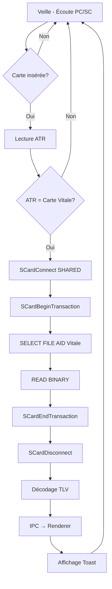
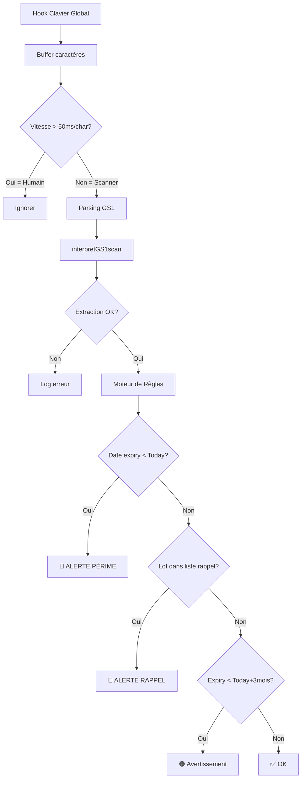
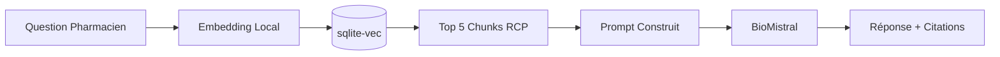
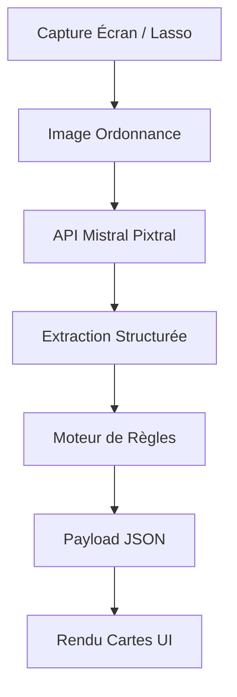

# 📚 PhiGenix X - Base de Connaissances

> **Dernière mise à jour :** 17 décembre 2024  
> **Objectif :** Fichier de référence centralisant la structure du projet, les ressources disponibles, les bonnes pratiques et les spécifications du projet Axora.

---

## 📂 Structure du Projet

```
PhiGenix X/
├── README.md                    # Description générale du projet
├── KNOWLEDGE_BASE.md            # Ce fichier de référence
├── Axora/                       # 🎯 APPLICATION PRINCIPALE À DÉVELOPPER
│   └── (projet Electron/React)
└── Lab/                         # Base de connaissances et ressources
    ├── documentation/           # Rapports et cahiers des charges
    │   ├── Rapport Officine 4.0
    │   └── Cahier des Charges Axora ⭐
    └── github_OS/               # Projets open source de référence
        ├── Barcode/             # Lecture de codes-barres GS1
        ├── CV_reader/           # Lecture de cartes à puce (Carte Vitale)
        └── WebUSBPrinter/       # Impression via WebUSB
```

---

# 🚀 PROJET AXORA - Spécifications Complètes

## Vision et Philosophie

**Axora** est une application **"Sidecar"** (compagnon) qui fonctionne en parallèle du LGO existant sans le modifier. C'est un **cockpit augmenté** pour le pharmacien.

### Principes Fondamentaux
- **Non-intrusif** : Ne perturbe jamais le LGO
- **Souverain** : IA locale, données locales
- **Réactif** : Détection passive, zéro clic superflu
- **Sécurisé** : Alertes bloquantes pour les risques critiques

---

## 🏗️ Architecture Technique

### Stack Technologique Validée

| Couche | Technologie | Justification |
|--------|-------------|---------------|
| **Framework** | Electron | Accès natif + technologies web |
| **UI** | React | Interface réactive, écosystème riche |
| **Carte Vitale** | `@pokusew/pcsclite` | Événementiel, binding PC/SC natif |
| **GS1/FMD** | `interpretGS1scan` | Référence officielle GS1 |
| **Hook Clavier** | `node-global-key-listener` | Léger, stable, moins de faux positifs antivirus |
| **Base Vectorielle** | `sqlite-vec` | In-process, ultra-léger, fichier local |
| **LLM Local** | BioMistral 7B (GGUF Q4_K_M) | Spécialisé médical, 4-6 Go RAM |
| **LLM Cloud** | API Mistral AI | Phase dev + fallback |
| **Exécution LLM** | `node-llama-cpp` | Binding llama.cpp pour Node.js |

### Architecture Electron

```
┌─────────────────────────────────────────────────────────────┐
│                         ELECTRON                             │
├──────────────────────────┬──────────────────────────────────┤
│     MAIN PROCESS         │       RENDERER PROCESS           │
│     (Node.js complet)    │       (Chromium + React)         │
│                          │                                  │
│  • node-pcsclite         │  • Interface utilisateur         │
│  • Global keyboard hooks │  • Affichage notifications       │
│  • sqlite-vec            │  • Cartes intelligentes          │
│  • node-llama-cpp        │  • Chat IA                       │
│  • Moteur de règles      │                                  │
│                          │                                  │
│         ←───── IPC (Context Isolation) ─────→               │
└──────────────────────────┴──────────────────────────────────┘
```

### Contraintes Techniques

- **Cible mémoire** : Application légère en veille
- **Architecture CPU** : x64 + AVX2 (obligatoire pour IA locale)
- **Pas de support 32-bit** : Abandonné officiellement
- **Compilation** : `@electron/rebuild` obligatoire pour modules natifs

---

## 📱 Interface Utilisateur : Dual-Mode

### Mode 1 : Compagnon (Usage courant)

```
┌────────────────────────────────────────────────┬───────┐
│                                                │       │
│                    LGO                         │ AXORA │
│              (plein écran)                     │  50px │
│                                                │       │
│                                                │  [●]  │
│                                                │       │
└────────────────────────────────────────────────┴───────┘
```

- Volet latéral rétractable (~50px)
- Fond opaque (contraste parfait)
- Se déplie au survol/clic
- Affiche notifications rapides

### Mode 2 : Hub (Fonctions complexes)

```
┌────────────────────────────────────────────────────────┐
│                                                        │
│                   AXORA HUB                            │
│              (overlay modal opaque)                    │
│                                                        │
│  ┌─────────────────────────────────────────────────┐   │
│  │  Chat IA / Tableaux de bord / Analyse détaillée │   │
│  └─────────────────────────────────────────────────┘   │
│                                                        │
└────────────────────────────────────────────────────────┘
```

- Activé par raccourci (Ctrl+Espace)
- Capture focus clavier/souris
- Ergonomie riche
- Restitue le focus au LGO à la fermeture

---

## 📦 MODULE 1 : Lecture Contextuelle Vitale

### Objectifs
- Détection instantanée de l'insertion de carte
- Affichage "Bonjour M. DUPONT" avant le LGO
- Lecture Zone Claire (NIR, Nom, Prénom, droits AMO)
- Notification Toast avec code couleur droits

### Workflow Technique



### Spécifications APDU

| Étape | Commande | Instruction |
|-------|----------|-------------|
| Identification | ATR | `3B 75 13...` = Carte Vitale |
| Sélection | SELECT FILE | `00 A4 04 00` + AID |
| Lecture | READ BINARY | `00 B0` + Offset + Length |
| Décodage | TLV | Tag 80=Nom, 81=Prénom, 82=NIR |

### Gestion Concurrence (Windows)

```javascript
// Stratégie de connexion partagée
reader.connect({ share_mode: SCARD_SHARE_SHARED }, (err, protocol) => {
  if (err) {
    // LGO a un lock exclusif - abandon silencieux ou retry 100ms
    return;
  }
  // Transaction atomique rapide
  reader.beginTransaction(() => {
    // Burst APDU (Select + Read)
    reader.endTransaction(() => {
      reader.disconnect(); // Libération immédiate
    });
  });
});
```

---

## 📦 MODULE 2 : Filet de Sécurité FMD

### Objectifs
- Interception globale des scans (même sans focus)
- Sanitisation FNC1
- Parsing GS1 robuste
- Alerte bloquante péremption/rappel lot

### Workflow Technique



### Distinction Humain vs Scanner

```javascript
const SCANNER_THRESHOLD_MS = 50;
let buffer = [];
let lastKeyTime = 0;

onKeyPress((key, timestamp) => {
  const delta = timestamp - lastKeyTime;
  lastKeyTime = timestamp;
  
  if (delta < SCANNER_THRESHOLD_MS) {
    buffer.push(key);
  } else {
    // Frappe humaine - reset buffer
    if (buffer.length > 10) {
      processBarcode(buffer.join(''));
    }
    buffer = [key];
  }
});
```

### Structure Données GS1

```json
{
  "gtin": "03400930000000",
  "batch": "H5522",
  "expiry": "251231",
  "serial": "SN98765432",
  "raw": "01034009300000001725123110H5522..."
}
```

### Interface Alerte Bloquante

- Fenêtre `alwaysOnTop: true, fullscreen: true`
- Fond rouge semi-transparent
- Texte géant : "PRODUIT PÉRIMÉ" / "LOT RAPPELÉ"
- Vol du focus = interruption réflexe "Entrée" du pharmacien

---

## 📦 MODULE 3 : Assistant Clinique RAG-Pharma

### Objectifs
- IA générative locale et souveraine
- Réponses basées uniquement sur documents médicaux vérifiés
- Zéro hallucination grâce au RAG
- Citations des sources

### Architecture RAG



### Pipeline d'Ingestion

1. **Sources** : RCP (PDF/XML), Thésaurus ANSM, Base Claude Bernard
2. **Chunking** : Découpage en paragraphes avec overlap
3. **Embedding** : `all-MiniLM-L6-v2` ou modèle multilingue
4. **Stockage** : Table virtuelle `vec0` dans SQLite

### Prompt Template RAG

```
Tu es un assistant pharmaceutique. Réponds à la question en utilisant 
UNIQUEMENT le contexte médical fourni ci-dessous. Si l'information 
n'est pas dans le contexte, dis "Je n'ai pas cette information dans 
ma base de données".

CONTEXTE:
[Chunk 1: ...texte RCP...]
[Chunk 2: ...texte RCP...]
[Chunk 3: ...texte RCP...]

QUESTION: {question_pharmacien}

RÉPONSE:
```

### Gestion Mémoire LLM

```javascript
// Inférence dans un worker/child process isolé
const { fork } = require('child_process');
const llmWorker = fork('./llm-worker.js');

llmWorker.on('message', (response) => {
  displayResponse(response);
  llmWorker.kill(); // Libération RAM immédiate
});
```

---

## 📦 MODULE 4 : PhiVision - Intelligence Visuelle

### Objectifs
- Analyse d'ordonnances via IA multimodale
- Détection interactions/contre-indications
- Scripts de conseils oraux standardisés
- Suggestions cross-selling éthique

### Architecture API-First



### Payload PhiVision

```json
{
  "medicaments": [
    {"dci": "Paracétamol", "dosage": "1g", "posologie": "3x/jour"}
  ],
  "advice_oral": "Attention, respectez bien 4h entre chaque prise",
  "points_cles": ["Éviter alcool", "Max 3g/jour"],
  "produits_cross": ["Probiotiques"],
  "alertes": [
    {"type": "warn", "label": "Alerte hépatique"},
    {"type": "info", "label": "Ordonnance 2 lignes"}
  ]
}
```

### Cartes Intelligentes

1. **Carte Conseil Immédiat**
   - Verbatim à dire au patient
   - Points clés de vigilance (Conduite, Soleil, Alcool)

2. **Carte Opportunités**
   - Produits complémentaires logiques
   - Argumentaire clinique ("Pourquoi ?")

3. **Badges Sécurité**
   - Tags colorés : 🟢 OK / 🟠 Attention / 🔴 Alerte

---

## 🔐 Sécurité et Bonnes Pratiques

### Architecture Electron Sécurisée

- **Context Isolation** : Activé obligatoirement
- **nodeIntegration** : Désactivé dans renderer
- **Preload Scripts** : Seule passerelle vers Node.js
- **IPC** : `ipcRenderer.invoke` / `ipcMain.handle` (pas de `send`)

### Stratégie IA Hybride

| Phase | Mode | Avantage |
|-------|------|----------|
| Développement | API Mistral Cloud | Rapidité, pas de contrainte matérielle |
| Production | BioMistral Local | Souveraineté, offline |
| Fallback | API Mistral | Résilience si PC faible |

### Pattern d'Abstraction IA

```javascript
// Interface générique
async function askAI(question, context) {
  if (config.useLocalLLM) {
    return await localLLM.generate(question, context);
  } else {
    return await mistralAPI.chat(question, context);
  }
}
```

---

## 📖 Index des Ressources

### Documentation
| Fichier | Chemin |
|---------|--------|
| Cahier des Charges Axora | `Lab/documentation/Cahier des Charges - Projet Axora.*` |
| Rapport Officine 4.0 | `Lab/documentation/Rapport...Officine 4.0...` |
| Spécifications Carte Vitale | `Lab/github_OS/CV_reader/Spécifications...pdf` |

### Projets GitHub OS (Lab)
| Composant | Chemin |
|-----------|--------|
| BarcodeParser | `Lab/github_OS/Barcode/BarcodeParser-master/` |
| interpretGS1scan | `Lab/github_OS/Barcode/interpretGS1scan-master/` |
| node-pcsclite | `Lab/github_OS/CV_reader/node-pcsclite-master/` |
| LL-Smartcard | `Lab/github_OS/CV_reader/LL-Smartcard-master/` |
| pcsc-server | `Lab/github_OS/CV_reader/pcsc-server-master/` |
| WebUSBReceiptPrinter | `Lab/github_OS/WebUSBPrinter/WebUSBReceiptPrinter-master/` |

### Dépendances Externes à Installer

| Package NPM | Usage |
|-------------|-------|
| `@pokusew/pcsclite` | Binding PC/SC |
| `node-global-key-listener` | Hook clavier global |
| `sqlite-vec` | Base vectorielle |
| `node-llama-cpp` | Exécution LLM local |
| `@electron/rebuild` | Compilation modules natifs |

### Projets Externes Recommandés

| Projet | GitHub | Usage |
|--------|--------|-------|
| api-bdpm-graphql | `axel-op/api-bdpm-graphql` | API médicaments |
| parseur-thesaurus | `axel-op/parseur-thesaurus-interactions-ansm` | Interactions |
| electron-react-boilerplate | `electron-react-boilerplate/...` | Template Electron |
| BioMistral | HuggingFace | LLM médical |

---

## ✅ Checklist de Développement

### Socle Technique
- [ ] Initialiser projet Electron + React (boilerplate)
- [ ] Configurer @electron/rebuild pour modules natifs
- [ ] Implémenter Context Isolation + IPC sécurisé
- [ ] Créer structure Main Process / Renderer Process

### Module 1 : Lecture Vitale
- [ ] Intégrer @pokusew/pcsclite
- [ ] Implémenter détection ATR
- [ ] Séquence APDU (SELECT + READ)
- [ ] Décodeur TLV
- [ ] Toast notification UI

### Module 2 : Filet FMD
- [ ] Intégrer node-global-key-listener
- [ ] Algorithme distinction humain/scanner
- [ ] Intégrer interpretGS1scan
- [ ] Moteur de règles péremption/rappel
- [ ] UI alerte bloquante

### Module 3 : RAG-Pharma
- [ ] Setup sqlite-vec
- [ ] Pipeline ingestion RCP
- [ ] Intégrer modèle embedding
- [ ] Intégrer node-llama-cpp + BioMistral
- [ ] Fallback API Mistral
- [ ] Interface chat

### Module 4 : PhiVision
- [ ] Capture écran (desktopCapturer)
- [ ] Intégration API Mistral Pixtral
- [ ] Moteur de règles métier
- [ ] Cartes intelligentes UI

### UX/UI
- [ ] Mode Compagnon (volet latéral)
- [ ] Mode Hub (overlay modal)
- [ ] Raccourcis clavier globaux
- [ ] Animations et transitions

---

## 🔄 Historique des Mises à Jour

| Date | Modification |
|------|--------------|
| 2024-12-17 | Création initiale - Cartographie des ressources Lab/ |
| 2024-12-17 | Enrichissement avec le rapport Officine 4.0 |
| 2024-12-17 | **Ajout complet des spécifications Axora** : 4 modules, stack technique, workflows, UI dual-mode |
