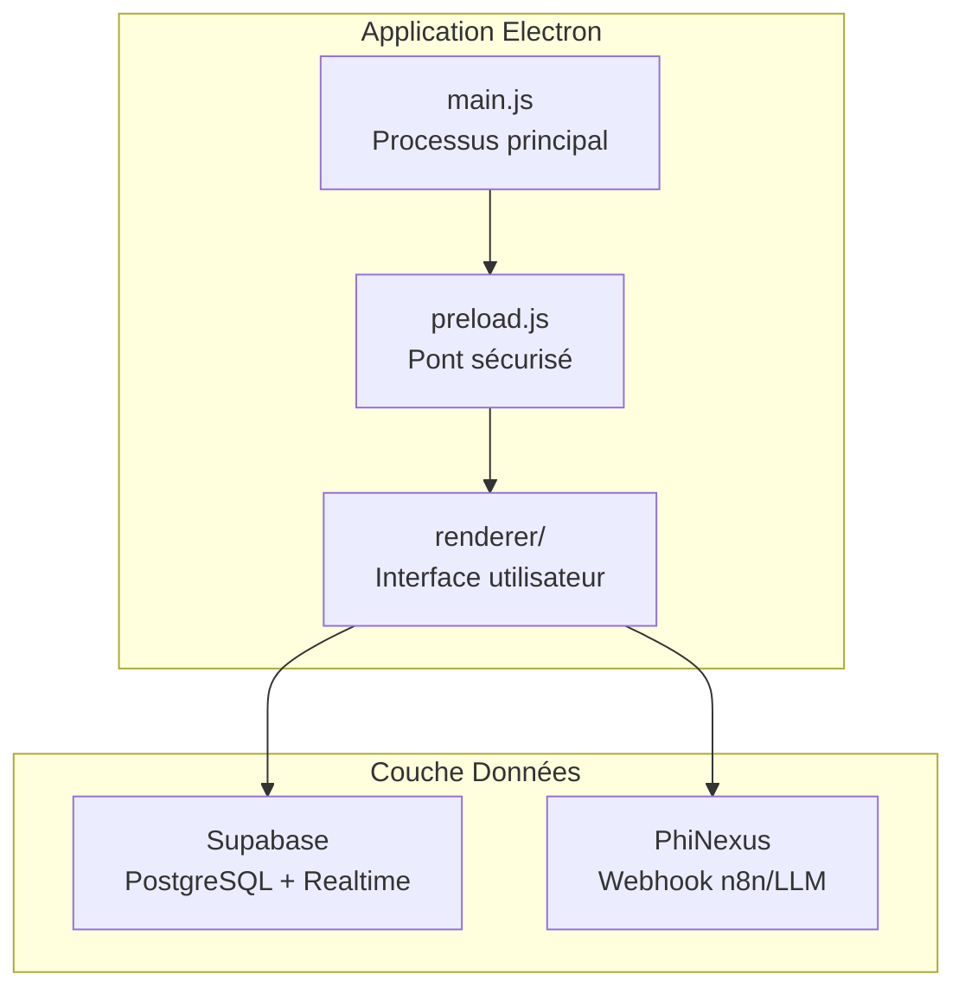
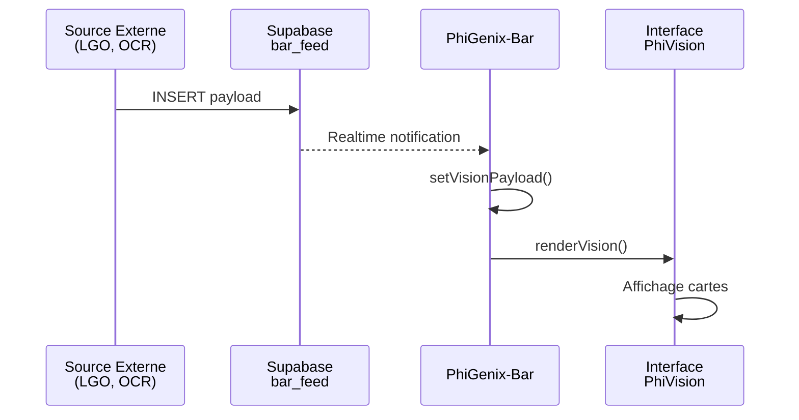
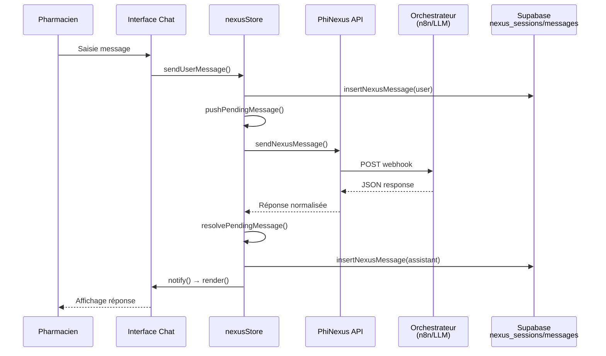
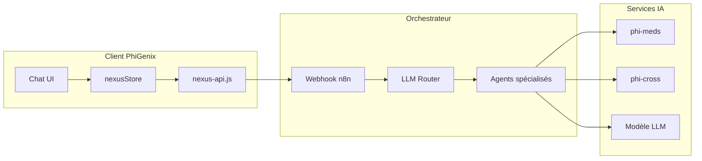
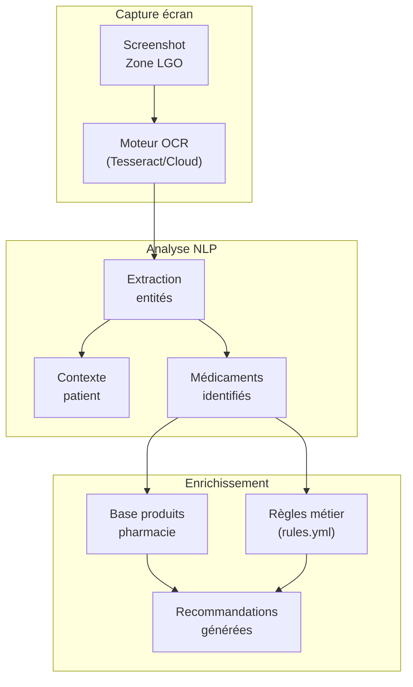

# 🏥 PhiGenix-Bar — Présentation Exhaustive

> **Barre augmentée pour pharmacien** — Un outil d'aide à la décision temps réel intégrant IA conversationnelle, analyse contextuelle et recommandations personnalisées.

---

## 📋 Sommaire

1. [Vue d'ensemble](#1-vue-densemble)
2. [Architecture technique](#2-architecture-technique)
3. [Workflows & Flux de données](#3-workflows--flux-de-données)
4. [Interface utilisateur (UI/UX)](#4-interface-utilisateur-uiux)
5. [Intelligence Artificielle & PhiNexus](#5-intelligence-artificielle--phinexus)
6. [Appels API & Intégrations](#6-appels-api--intégrations)
7. [Analyse OCR & Extraction contextuelle](#7-analyse-ocr--extraction-contextuelle)
8. [Valeur ajoutée créée](#8-valeur-ajoutée-créée)
9. [Configuration & Déploiement](#9-configuration--déploiement)

---

## 1. Vue d'ensemble

### 1.1 Identité produit

| Attribut | Valeur |
|----------|--------|
| **Nom** | PhiGenix-Bar (OffiPilot) |
| **Version** | 5.5 |
| **Description** | Barre augmentée pour pharmacien — assistant temps réel de l'officine |
| **Plateforme** | Electron (Mac, Windows) |
| **Catégorie** | Logiciel médical (`public.app-category.medical`) |

### 1.2 Proposition de valeur

PhiGenix-Bar est une **application desktop overlay** qui se positionne en haut de l'écran du pharmacien, offrant :

- 🤖 **Assistant IA conversationnel** (PhiNexus) pour répondre aux questions cliniques
- 👁️ **Analyse visuelle temps réel** (PhiVision) des ordonnances et produits à l'écran
- 💊 **Recommandations personnalisées** basées sur le contexte patient
- ⚠️ **Alertes de sécurité** (interactions médicamenteuses, contre-indications)
- 📊 **Insights pharmacie** (module en développement)

### 1.3 Raccourcis clavier

| Raccourci | Action |
|-----------|--------|
| `⌘⇧P` (Mac) / `Ctrl+Shift+P` (Windows) | Afficher/Masquer la barre |
| `Alt+T` | Charger données de démonstration |
| `Escape` | Fermer les modales |

---

## 2. Architecture technique

### 2.1 Stack technologique



### 2.2 Structure des fichiers

```
phigenix-bar-mac/
├── main.js              # Processus Electron principal
├── preload.js           # Bridge sécurisé IPC
├── index.html           # Interface utilisateur (CSS + HTML)
├── rules.yml            # Règles métier (conseils par produit)
├── renderer/
│   ├── index.js         # Point d'entrée renderer
│   ├── app.js           # Initialisation application
│   ├── data/
│   │   ├── supabase.js  # Client Supabase & Realtime
│   │   └── nexus-api.js # API PhiNexus
│   ├── state/
│   │   ├── store.js     # State manager (tabs, vision)
│   │   └── nexusStore.js# State PhiNexus (sessions, messages)
│   └── ui/
│       ├── tabs.js      # Gestion des onglets
│       ├── nexus.js     # Interface chat PhiNexus
│       └── vision.js    # Rendu PhiVision
├── vendor/
│   └── supabase.js      # Bundle Supabase UMD
├── docs/
│   └── phinexus-contract.md # Spécification API
└── build/               # Assets de build (icons, entitlements)
```

### 2.3 Sécurité Electron

| Mécanisme | Description |
|-----------|-------------|
| **Context Isolation** | `contextIsolation: true` — Isolation complète renderer/main |
| **Sandbox** | `sandbox: true` — Processus renderer sandboxé |
| **No Node Integration** | `nodeIntegration: false` — Pas d'accès Node dans le renderer |
| **CSP** | Politique de sécurité du contenu stricte |
| **Single Instance Lock** | Empêche les instances multiples |

---

## 3. Workflows & Flux de données

### 3.1 Workflow Principal — PhiVision



**Étapes détaillées :**

1. **Réception des données** : Un système externe (logiciel de gestion officine, OCR) insère un payload JSON dans `bar_feed`
2. **Notification temps réel** : Supabase Realtime propage l'événement via WebSocket
3. **Mise à jour du state** : Le store met à jour le payload vision
4. **Rendu UI** : Les cartes sont mises à jour dynamiquement

### 3.2 Workflow PhiNexus (Chat IA)



### 3.3 Structure du payload PhiVision

```json
{
  "advice_oral": "Conseil verbal à donner au patient",
  "advice_points": [
    "Point clé 1",
    "Point clé 2"
  ],
  "dci": ["DOLIPRANE 1000MG", "PHLOROGLUCINOL"],
  "recommandations": [
    "Paracétamol : max 60 mg/kg/j",
    "Éviter association avec alcool"
  ],
  "produits": ["Solution ORS", "Probiotiques"],
  "pourquoi": [
    "Prévenir la déshydratation",
    "Restaurer la flore"
  ],
  "badges": [
    { "label": "Ordonnance 2 lignes" },
    { "label": "Alerte hépatique", "type": "warn" }
  ]
}
```

---

## 4. Interface utilisateur (UI/UX)

### 4.1 Design System

| Variable CSS | Valeur | Usage |
|--------------|--------|-------|
| `--bg-deep` | `#0b1220` | Fond principal sombre |
| `--cyan` | `#36D1DC` | Accent primaire |
| `--iris` | `#5B86E5` | Accent secondaire |
| `--mint` | `#2EE4C6` | Indicateurs actifs |
| `--amber` | `#F7C65C` | Alertes/warnings |
| `--glass-bg` | `rgba(12,16,24,0.94)` | Effet verre dépoli |

### 4.2 Onglets disponibles

| Onglet | Statut | Description |
|--------|--------|-------------|
| **PhiNexus Beta** | ✅ Actif | Assistant conversationnel IA |
| **PhiVision** | ✅ Actif | Analyse contextuelle temps réel |
| **Pharma Insights** | 🔒 Bientôt | Tableau de bord analytique |

### 4.3 Composants PhiVision

```
┌─────────────────────────────────────────────────────────────────────┐
│ 📊 MÉDICAMENTS & NOS RECOMMANDATIONS                                │
├────────────────────────────┬────────────────────────────────────────┤
│ 💬 Conseil oral            │ 💊 Médicaments & Produits en stock     │
│ ─────────────────          │ ───────────────────────────────────    │
│ Texte du conseil verbal    │ • DOLIPRANE 1000MG                     │
│ à transmettre au patient   │ • PHLOROGLUCINOL 1                     │
│                            │ • RACECADOTRIL 100                     │
├────────────────────────────┼────────────────────────────────────────┤
│ ✓ Points clés patient      │ 📋 Nos recommandations                 │
│ ─────────────────────      │ ────────────────────                   │
│ • Point important 1        │ • Recommandation posologie 1           │
│ • Point important 2        │ • Recommandation sécurité 2            │
└────────────────────────────┴────────────────────────────────────────┘
┌─────────────────────────────────────────────────────────────────────┐
│ 🛒 PRODUITS COMPLÉMENTAIRES & POURQUOI                              │
├─────────────────────────────────┬───────────────────────────────────┤
│ Nos produits complémentaires    │ Pourquoi                          │
│ ────────────────────────────    │ ────────                          │
│ • Solution de réhydratation     │ • Prévenir la déshydratation      │
│ • Sachets de probiotiques       │ • Restaurer la flore              │
└─────────────────────────────────┴───────────────────────────────────┘
┌─────────────────────────────────────────────────────────────────────┐
│ 🏷️ [Ordonnance 2 lignes] [⚠️ Alerte hépatique] [+ Fiche posologie] │
└─────────────────────────────────────────────────────────────────────┘
```

### 4.4 Composants UI PhiNexus

Le chat PhiNexus supporte plusieurs types de composants riches :

| Type | Description |
|------|-------------|
| `text` | Bloc paragraphe Markdown |
| `productList` | Liste de produits avec CTA |
| `alert` | Information critique (warning/danger) |
| `badgeList` | Micro-rappels sous forme de chips |
| `suggestions` | Boutons de relance conversationnelle |
| `metricCards` | Cartes statistiques (stock, marge) |
| `timeline` | Étapes séquentielles (protocole) |

### 4.5 Mode Focus

Toggle disponible pour dimmer les cartes non survolées, permettant de se concentrer sur une information spécifique.

---

## 5. Intelligence Artificielle & PhiNexus

### 5.1 Architecture PhiNexus



### 5.2 Contrat d'échange PhiNexus

**Requête (client → orchestrateur) :**
```json
{
  "sessionId": "uuid",
  "message": "Question du pharmacien",
  "context": {
    "pharmacyId": "...",
    "deviceId": "...",
    "profile": { "ton": "clinique" }
  },
  "timestamp": 1702856400000
}
```

**Réponse (orchestrateur → client) :**
```json
{
  "session": {
    "id": "uuid",
    "title": "Titre de session",
    "context": { ... }
  },
  "message": {
    "id": "uuid",
    "role": "assistant",
    "content": "Réponse textuelle (Markdown)",
    "components": [ ... ],
    "actions": [ ... ],
    "metadata": {
      "sources": [
        { "label": "VIDAL", "url": "https://..." }
      ],
      "processing": {
        "elapsed_ms": 1850,
        "agents": ["llm-router", "phi-meds"]
      },
      "confidence": 0.82
    }
  }
}
```

### 5.3 Gestion des sessions

| Table Supabase | Champs clés |
|----------------|-------------|
| `nexus_sessions` | `id`, `pharmacy_id`, `device_id`, `title`, `profile`, `status`, `last_message_at` |
| `nexus_messages` | `id`, `session_id`, `role`, `content`, `components`, `actions`, `metadata`, `raw_payload` |

### 5.4 Fonctionnalités IA

- ✅ **Conversation contextuelle** avec mémoire de session
- ✅ **Suggestions intelligentes** de relance
- ✅ **Actions contextuelles** (CTAs interactifs)
- ✅ **Traçabilité des sources** (VIDAL, HAS, etc.)
- ✅ **Métriques de performance** (temps de réponse, agents utilisés)
- ✅ **Score de confiance** sur les réponses

---

## 6. Appels API & Intégrations

### 6.1 Supabase (Backend as a Service)

**Configuration :**
```bash
# Variables d'environnement
export PGX_SUPABASE_URL="https://xxx.supabase.co"
export PGX_SUPABASE_ANON_KEY="<clé anonyme>"
export PGX_PHARMACY_ID="..."
export PGX_DEVICE_ID="..."
```

**Endpoints utilisés :**

| Opération | Table | Description |
|-----------|-------|-------------|
| `SELECT` | `bar_feed` | Récupération du dernier payload vision |
| `REALTIME` | `bar_feed` | Écoute des INSERT en temps réel |
| `UPSERT` | `nexus_sessions` | Création/MAJ session chat |
| `INSERT` | `nexus_messages` | Persistance messages |
| `UPDATE` | `nexus_sessions` | Touch `last_message_at` |

### 6.2 PhiNexus Webhook

**Configuration :**
```javascript
// Stocké dans userData: ~/Library/Application Support/phigenix-bar/phigenix-config.json
{
  "nexusEndpoint": "https://n8n.example.com/webhook/phinexus",
  "nexusTimeoutMs": 15000
}
```

**Communication IPC :**

| Canal | Direction | Description |
|-------|-----------|-------------|
| `phinexus:send` | Renderer → Main | Envoi message au webhook |
| `phinexus:status` | Renderer → Main | Vérification configuration |
| `phinexus:setEndpoint` | Renderer → Main | Mise à jour endpoint |

### 6.3 API interne (IPC Electron)

| Canal | Payload | Description |
|-------|---------|-------------|
| `pgx:toggle` | — | Afficher/masquer la barre |
| `pgx:resize` | `{ height: number }` | Redimensionner la fenêtre |
| `pgx:log` | `string` | Log côté main process |
| `pgx:reanchor` | — | Ré-ancrer en haut de l'écran |

---

## 7. Analyse OCR & Extraction contextuelle

### 7.1 Pipeline d'extraction (conception)



### 7.2 Données extraites

| Catégorie | Exemples de données |
|-----------|---------------------|
| **Patient** | Âge, poids, grossesse, allergies connues |
| **Ordonnance** | Prescripteur, date, nombre de lignes |
| **Médicaments** | DCI, dosage, forme galénique, posologie |
| **Contexte** | Indications, durée de traitement |

### 7.3 Rules Engine

Le fichier `rules.yml` définit des règles métier conditionnelles :

```yaml
rappels:
  - condition: "produit ~= 'DOLIPRANE' && dose_mg == 500"
    conseils:
      - "Posologie enfant: 15 mg/kg/prise, ≥6 h, max 60 mg/kg/j."
      - "Hydratation + suivi T° ; éviter doublons paracétamol."
    alerte:
      - "Hépatique/alcool/poids <50 kg → prudence / avis."
    ctas:
      - { id: "fiche-poso", label: "Fiche posologie", url: "phigenix://poso_paracetamol" }
      - { id: "add-thermo", label: "+ Thermomètre" }
```

---

## 8. Valeur ajoutée créée

### 8.1 Pour le pharmacien

| Bénéfice | Description |
|----------|-------------|
| ⏱️ **Gain de temps** | Informations contextuelles instantanées, sans recherche manuelle |
| 🛡️ **Sécurité patient** | Alertes interactions, contre-indications automatiques |
| 💡 **Aide à la décision** | Recommandations basées sur les bonnes pratiques |
| 📈 **Ventes additionnelles** | Suggestions de produits complémentaires pertinents |
| 🎓 **Formation continue** | Sources citées, apprentissage contextuel |

### 8.2 Pour le patient

| Bénéfice | Description |
|----------|-------------|
| 💬 **Conseil personnalisé** | Conseils oraux adaptés à chaque situation |
| ✅ **Sécurité renforcée** | Détection proactive des risques |
| 📋 **Information claire** | Points clés mémorisables |

### 8.3 Pour l'officine

| Bénéfice | Description |
|----------|-------------|
| 📊 **Standardisation** | Qualité de conseil homogène entre collaborateurs |
| 🔍 **Traçabilité** | Historique des sessions et recommandations |
| 🚀 **Innovation** | Positionnement différenciant sur le marché |

### 8.4 Métriques clés

- **Temps de réponse IA** : Affiché en temps réel (`elapsed_ms`)
- **Score de confiance** : Indicateur de fiabilité (0-1)
- **Agents utilisés** : Transparence sur le pipeline IA
- **Diagnostics réseau** : Moyenne et dernier temps de réponse

---

## 9. Configuration & Déploiement

### 9.1 Prérequis

- **Node.js** ≥ 18
- **Electron** 31.2.0
- Compte **Supabase** avec tables configurées
- (Optionnel) Webhook **n8n** pour PhiNexus

### 9.2 Installation

```bash
# Cloner le repo
cd phigenix-bar-mac

# Installer les dépendances
npm install

# Configurer les variables d'environnement
export PGX_SUPABASE_URL="https://xxx.supabase.co"
export PGX_SUPABASE_ANON_KEY="..."
export PGX_PHARMACY_ID="..."
export PGX_DEVICE_ID="..."

# Lancer en développement
npm run dev
```

### 9.3 Build production

```bash
# Mac (DMG signé)
npm run build:mac

# Mac (DMG non signé)
npm run build:mac:unsigned

# Windows (NSIS installer)
npm run build:win
```

### 9.4 Fichiers de build

| Fichier | Usage |
|---------|-------|
| `build/icon.icns` | Icône application Mac |
| `build/icon.ico` | Icône application Windows |
| `build/entitlements.mac.plist` | Entitlements macOS |
| `build/afterSign.js` | Script post-signature (notarization) |
| `build/EULA.txt` | Licence utilisateur |

---

## 🎯 Conclusion

**PhiGenix-Bar** représente une avancée significative dans l'outillage numérique des pharmaciens d'officine. En combinant :

- 🖥️ **Une interface overlay non intrusive** intégrée au workflow existant
- 🤖 **Une IA conversationnelle spécialisée** (PhiNexus)
- 👁️ **Une analyse contextuelle temps réel** (PhiVision)
- 🔗 **Des intégrations backend robustes** (Supabase, n8n)

L'application crée une **synergie unique** entre l'expertise du pharmacien et la puissance de l'intelligence artificielle, au service de la sécurité et de la qualité du conseil patient.

---

*Document généré le 17 décembre 2025 — PhiGenix v5.5*
